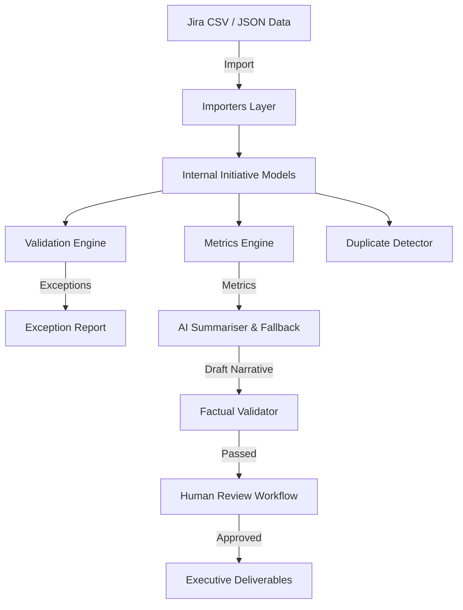

# AI-Enabled Enterprise Portfolio PMO System

> **A Demonstration-Grade Portfolio Management System Integrating AI Assistance, Automated Data Quality Validation, and Reproducible Executive Deliverables.**
>
> **STATEMENT:** SYNTHETIC DEMONSTRATION DATA — NOT FROM A REAL ORGANISATION.

---

## 📋 What This Demonstrates

This repository provides demonstrable evidence of practical capabilities expected of an **AI-Enabled PMO Analyst / Portfolio Delivery Manager**, including:

1. **Structured Portfolio Data Management:** Ingestion and normalization of Jira-style CSV/JSON data across **50 synthetic initiatives** in **5 functional domains** (Technology Delivery, Data & Analytics, AI & Machine Learning, Cyber Security, and Fraud Prevention).
2. **Automated Data Quality Assurance:** Rule engine enforcing 15 business rules to detect stale records (>30 days), missing owners/sponsors, orphan dependencies, and budget spend overruns (>15%).
3. **AI Assistance with Factual Controls:** Automated narrative drafting (offline fallback or pluggable LLM) backed by a 6-part factual validation taxonomy (NIST AI RMF aligned) and human review state machine (`DRAFT` → `UNDER_REVIEW` → `APPROVED`).
4. **Executive Deliverable Generation:** Single-command generation of print-optimized **One-Page Executive Views**, multi-tab **Excel Workbooks**, 8-slide **PowerPoint Governance Packs**, and static **HTML Dashboards**.
5. **Demand Deduplication & Prioritisation:** TF-IDF text similarity algorithm identifying potential duplicate initiative proposals during front-door intake shaping.

---

## 🚀 Quick Start

### Prerequisites
- Python 3.10+ (No external database required; runs with standard Python libraries)

### Execution Command
Run the primary master runner command to generate all datasets, execute validation, build deliverables, and run the automated test suite:

```bash
# Run complete end-to-end master runner
python scripts/run_all.py
```

### Run Automated Tests
```bash
python -m unittest discover -s tests -p "test_*.py"
```

---

## 📊 Sample Deliverables

All generated sample deliverables are stored in `outputs/samples/`:

- 📄 **One-Page Executive View:** `outputs/samples/one_page_view.html`
- 📊 **Excel Portfolio Workbook:** `outputs/samples/portfolio_workbook.csv`
- 📑 **PowerPoint Governance Pack:** `outputs/samples/governance_pack.pptx.txt`
- 📝 **Monthly Portfolio Update:** `outputs/samples/monthly_update.html`
- ⚠️ **Data Quality Exception Report:** `outputs/samples/data_quality_report.html`
- 🖥️ **Local HTML Dashboard:** `outputs/samples/dashboard/index.html`

---

## 🏗️ System Architecture



---

## 🛡️ AI Assurance & Factual Validation Taxonomy

AI-generated narrative summaries are cross-checked against underlying ground-truth metrics prior to human review using 6 core rules:

- **VAL-01 (`status_match`):** Ground-truth RAG status verification in summary text.
- **VAL-02 (`count_match`):** Initiative count reconciliation.
- **VAL-03 (`date_consistency`):** Milestone date accuracy check.
- **VAL-04 (`rag_consistency`):** RAG alignment with spend overruns (>15%).
- **VAL-05 (`named_entity_match`):** Title and entity verification.
- **VAL-06 (`completeness_check`):** Required structural section validation.

---

## 🎤 Interview Demonstration Paths

Detailed interview talking points and sequence paths are documented in [`career/interview-walkthrough.md`](file:///C:/Users/elber/.gemini/antigravity/scratch/ai-enabled-portfolio-pmo/career/interview-walkthrough.md):

- **5-Minute Path (Recruiter):** Dashboard overview → One-page view → AI assurance explanation.
- **15-Minute Path (Hiring Manager):** 5-min path + Data Quality Engine + Intake Deduplication + Governance Pack.
- **30-Minute Path (Technical Deep Dive):** 15-min path + Code walkthrough + Factual validator + Test suite run.

---

## 📄 License & Boundaries

- **License:** [MIT License](LICENSE)
- **Positioning:** This project is a personal portfolio demonstration using 100% synthetic data. It is not deployed for a commercial employer. See [`career/honest-claims-boundary.md`](file:///C:/Users/elber/.gemini/antigravity/scratch/ai-enabled-portfolio-pmo/career/honest-claims-boundary.md) for career positioning details.
