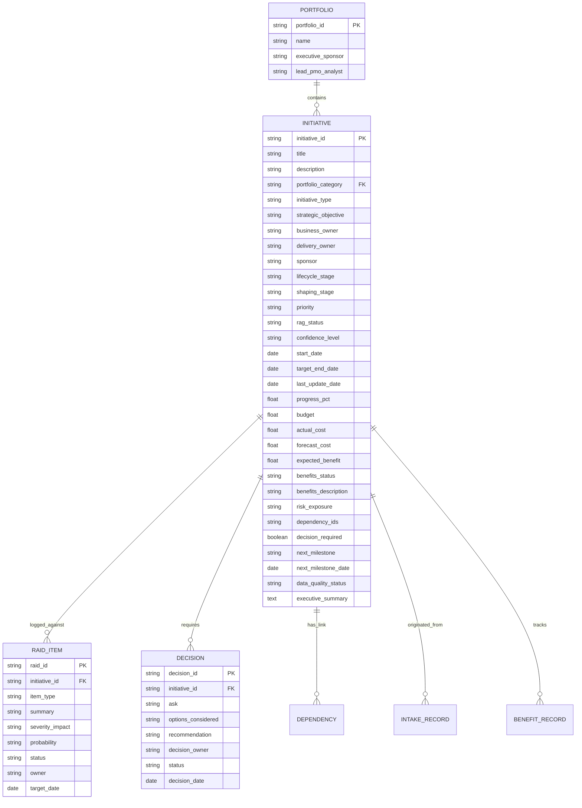

# Enterprise Portfolio Data Model Documentation — ai-enabled-portfolio-pmo

## 1. Entity-Relationship Conceptual Model

## 2. Field-Level Data Dictionary & Attributes

| Field ID | Entity | Attribute Name | Type | Description | Mandatory | Validation Rule |
|---|---|---|---|---|---|---|
| DATA-001 | Initiative | `initiative_id` | String | Unique Initiative ID | YES | Pattern `INIT-[0-9]{3}` |
| DATA-002 | Initiative | `title` | String | Initiative Title | YES | Length 5–150 chars |
| DATA-003 | Initiative | `description` | Text | Objective & Scope narrative | YES | Non-empty |
| DATA-004 | Initiative | `portfolio_category` | Enum | Functional Category | YES | Tech, Data, AI, Cyber, Fraud |
| DATA-005 | Initiative | `lifecycle_stage` | Enum | Portfolio stage | YES | Intake, Shaping, Approved, Active, Closed |
| DATA-006 | Initiative | `shaping_stage` | Enum | Intake shaping state | YES | Submitted, Triage, Business_Case, Governance_Gate, Completed |
| DATA-007 | Initiative | `rag_status` | Enum | Health indicator | YES | RED, AMBER, GREEN |
| DATA-008 | Initiative | `confidence_level` | Enum | Delivery confidence | YES | HIGH, MEDIUM, LOW |
| DATA-009 | Initiative | `start_date` | Date | Planned Start | YES | YYYY-MM-DD |
| DATA-010 | Initiative | `target_end_date` | Date | Target Completion | YES | `start_date <= target_end_date` |
| DATA-011 | Initiative | `last_update_date` | Date | Last PMO update | YES | Staleness if > 30 days old |
| DATA-012 | Initiative | `progress_pct` | Float | Completion percentage | YES | 0.0 to 100.0 |
| DATA-013 | Initiative | `budget` | Float | Approved budget (£) | YES | ≥ 0.0 |
| DATA-014 | Initiative | `actual_cost` | Float | Actual spend to date (£) | YES | ≥ 0.0 |
| DATA-015 | Initiative | `forecast_cost` | Float | Forecast at completion (£)| YES | `forecast_cost >= actual_cost` |
| DATA-016 | Initiative | `expected_benefit` | Float | Estimated ROI (£) | NO | Non-negative if defined |
| DATA-017 | Initiative | `benefits_status` | Enum | Benefits realisation state| YES | NOT_DEFINED, ON_TRACK, AT_RISK, DELAYED, REALISED |
| DATA-018 | Initiative | `risk_exposure` | Enum | Combined risk rating | YES | HIGH, MEDIUM, LOW |
| DATA-019 | Initiative | `decision_required` | Boolean| Flag if exec action needed | YES | True / False |

## 3. Lifecycle States & Transition Rules

1. **Intake:** Submitted proposal awaiting initial triage.
2. **Shaping:** Active business case drafting, architecture review, and prioritisation.
3. **Approved:** Governance approval granted; awaiting resource mobilisation.
4. **Active:** Delivery in progress; subject to monthly RAG reporting.
5. **Closed:** Project completed or cancelled. All critical actions resolved.
