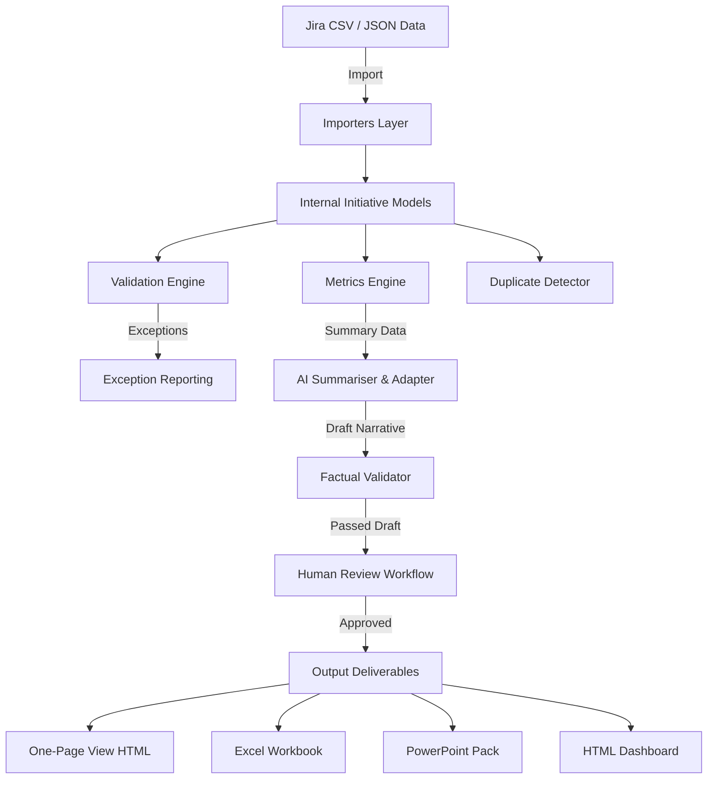

# Enterprise Portfolio System Architecture

## System Architecture Diagram

## Architectural Design Decisions
- **Monorepo Structure:** Clean Python monorepo for simple maintainability.
- **File-Based Storage:** Zero database infrastructure; git-versioned synthetic CSV/JSON data.
- **Deterministic Offline Fallback:** Fully functional offline mode requiring no API key.
- **Modular Pipelines:** Decoupled data models, validation engine, metrics calculation, and output generators.
